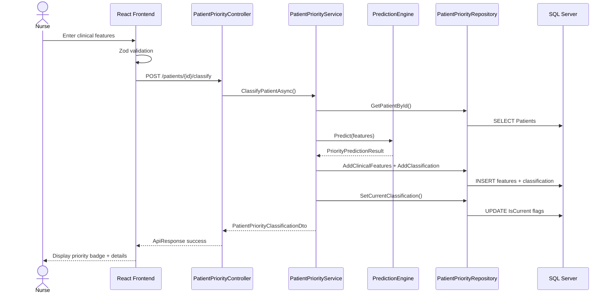

# Patient Priority Classification Module
## Clinic Appointment Booking System — ML-Based Triage

---

## 1. Business Understanding

The **Patient Priority Classification** module automates clinical triage by analyzing patient vitals, symptoms, and medical history to assign a priority level (**Critical**, **High**, **Medium**, **Low**). This enables:

- **Faster emergency response** for high-risk patients
- **Optimized appointment queue** sorting by clinical urgency
- **Audit trail** of ML predictions and clinical overrides
- **Data-driven scheduling** for doctors and nurses

The module sits between **Patient Registration** and **Appointment Booking**, classifying patients before or during appointment creation.

---

## 2. Business Workflow

```
┌─────────────────┐     ┌──────────────────────┐     ┌─────────────────────┐
│ Patient arrives │────▶│ Capture clinical     │────▶│ ML Engine predicts  │
│ or books appt   │     │ features (vitals,    │     │ priority + confidence│
└─────────────────┘     │ symptoms, history)   │     └──────────┬──────────┘
                        └──────────────────────┘                │
                                                                  ▼
┌─────────────────┐     ┌──────────────────────┐     ┌─────────────────────┐
│ Appointment     │◀────│ Staff reviews result │◀────│ Store classification│
│ queue sorted    │     │ (optional override)  │     │ + link to appointment│
└─────────────────┘     └──────────────────────┘     └─────────────────────┘
```

**Steps:**
1. Receptionist/nurse opens patient record or appointment
2. Clinical features are entered (vitals, symptoms, comorbidities)
3. ML engine computes risk score and priority level
4. Result is stored with model version and confidence
5. Doctor/nurse may override with clinical justification
6. Appointment queue uses effective priority for sorting

---

## 3. User Stories

| ID | Role | Story | Acceptance Criteria |
|----|------|-------|---------------------|
| PP-01 | Nurse | Enter vitals and symptoms to classify patient priority | ML returns level + confidence; result saved |
| PP-02 | Receptionist | View current priority badge on patient profile | Badge shows effective level with color |
| PP-03 | Doctor | Override ML classification with reason | Override logged; effective level updated |
| PP-04 | Admin | View active ML model version and accuracy | API returns model metadata |
| PP-05 | Doctor | View classification history for a patient | Paginated history with timestamps |
| PP-06 | System | Link classification to appointment | Appointment.CurrentPriorityClassificationId set |
| PP-07 | Admin | Configure priority levels lookup | CRITICAL/HIGH/MEDIUM/LOW seeded and editable |

---

## 4. Database Design

### Module Tables

| Table | Purpose |
|-------|---------|
| `PriorityLevels` | Lookup: Critical, High, Medium, Low |
| `MlModelVersions` | ML model registry (name, version, accuracy) |
| `PatientClinicalFeatures` | Input features at classification time |
| `PatientPriorityClassifications` | ML output (level, confidence, risk score) |
| `PriorityClassificationOverrides` | Manual staff overrides |

### Supporting Tables (FK Parents)

| Table | Relationship |
|-------|--------------|
| `Patients` | Parent of clinical features and classifications |
| `Appointments` | Optional link; receives `CurrentPriorityClassificationId` |
| `Users` | Audit: captured by, classified by, overridden by |

---

## 5. SQL Create Table Scripts

Located in `AppointmentBooking-BE/Database/Scripts/`:

| Script | Description |
|--------|-------------|
| `001_Create_Database.sql` | Create `AppointmentBooking` database |
| `002_Create_Users_And_Roles.sql` | Auth tables |
| `003_Create_Patients.sql` | Patient master |
| `004_Create_Doctors_And_Clinics.sql` | Clinic/doctor |
| `005_Create_Appointments.sql` | Appointments + statuses |
| **`006_Create_PatientPriority_Module.sql`** | **Priority module tables + FK to Appointments** |

### Seed Scripts (`Insert/`)

| Script | Description |
|--------|-------------|
| `001_Seed_Roles.sql` | Admin, Doctor, Nurse, Receptionist |
| `002_Seed_PriorityLevels.sql` | CRITICAL, HIGH, MEDIUM, LOW |
| `003_Seed_MlModelVersions.sql` | PatientPriorityClassifier v1.0.0 |
| `004_Seed_AppointmentStatuses.sql` | Scheduled, Confirmed, etc. |
| `005_Seed_Sample_Patient.sql` | PAT-00001 John Doe |
| `006_Seed_Admin_User.sql` | admin / Admin@123 |

### Update Scripts (`Update/`)

| Script | Description |
|--------|-------------|
| `001_Update_PatientPriority_SetCurrent.sql` | Stored proc to mark current classification |

---

## 6. Table Relationships

```
Patients ─────────────┬──▶ PatientClinicalFeatures
                      │         │
                      │         ▼
                      └──▶ PatientPriorityClassifications ◀── MlModelVersions
                                │              │
                                │              └──▶ PriorityLevels (Predicted)
                                │
                                ├──▶ PriorityClassificationOverrides
                                │         └──▶ PriorityLevels (Original / Override)
                                │
Appointments ◀── CurrentPriorityClassificationId
     │
     └──▶ Patients, Doctors, Clinics, AppointmentStatuses

Users ──▶ CapturedBy, ClassifiedBy, OverriddenBy (audit FKs)
```

---

## 7. Foreign Keys with Existing Modules

| FK | From | To | Module |
|----|------|-----|--------|
| `FK_PatientClinicalFeatures_Patients` | PatientClinicalFeatures | Patients | Patient Management |
| `FK_PatientClinicalFeatures_Appointments` | PatientClinicalFeatures | Appointments | Appointment Booking |
| `FK_PatientPriorityClassifications_Patients` | PatientPriorityClassifications | Patients | Patient Management |
| `FK_Appointments_PatientPriorityClassifications` | Appointments | PatientPriorityClassifications | **Cross-module link** |
| `FK_*_Users` | Multiple | Users | Authentication |

---

## 8. Entity Framework DB First Commands

See `Database/Scripts/EF_DatabaseFirst_Commands.sql`.

**Quick start (after running SQL scripts):**

```powershell
dotnet tool install --global dotnet-ef

cd "AppointmentBooking-BE\AppointmentBooking.Database"

dotnet ef dbcontext scaffold `
  "Server=localhost;Database=AppointmentBooking;Trusted_Connection=True;TrustServerCertificate=True;" `
  Microsoft.EntityFrameworkCore.SqlServer `
  -o Entities/Scaffolded `
  -c AppointmentBookingDbContextScaffolded `
  --force `
  --no-onconfiguring
```

**Note:** Hand-crafted entities in `Entities/DomainEntities.cs` mirror the SQL schema. Re-scaffold on schema changes and merge.

---

## 9. Repository Pattern Implementation

```
AppointmentBooking.Repository/
├── Interfaces/
│   ├── IPatientPriorityRepository.cs
│   └── IUserRepository.cs
└── Implementations/
    ├── PatientPriorityRepository.cs
    └── UserRepository.cs
```

**Key methods (`IPatientPriorityRepository`):**
- `GetCurrentClassificationAsync(patientId)`
- `AddClinicalFeaturesAsync` / `AddClassificationAsync`
- `SetCurrentClassificationAsync` — marks previous as not current
- `LinkAppointmentToClassificationAsync`
- `AddOverrideAsync`

Registered via `Repository.DependencyInjection.AddRepositoryServices()`.

---

## 10. Service Layer Implementation

```
AppointmentBooking.Application/
├── Interfaces/
│   ├── IPatientPriorityService.cs
│   └── ML/IPatientPriorityPredictionEngine.cs
├── Services/
│   ├── PatientPriorityService.cs
│   └── ML/PatientPriorityPredictionEngine.cs
├── DTOs/PatientPriority/
├── Validators/
└── Exceptions/
```

**Flow in `PatientPriorityService.ClassifyPatientAsync`:**
1. Validate DTO (FluentValidation)
2. Verify patient and optional appointment exist
3. Call ML engine → get prediction
4. Persist clinical features + classification
5. Set as current; link to appointment if provided

---

## 11. API Endpoints

Base route: `/api/patient-priority` (JWT required except `/levels`)

| Method | Endpoint | Roles | Description |
|--------|----------|-------|-------------|
| `POST` | `/patients/{patientId}/classify` | Admin, Doctor, Nurse, Receptionist | Run ML classification |
| `GET` | `/patients/{patientId}/current` | Admin, Doctor, Nurse, Receptionist | Get current classification |
| `GET` | `/patients/{patientId}/history` | Admin, Doctor, Nurse | Paginated history |
| `POST` | `/classifications/{id}/override` | Admin, Doctor | Clinical override |
| `GET` | `/levels` | Anonymous | Priority level lookup |
| `GET` | `/model/active` | Admin, Doctor | Active ML model info |

**Auth:** `POST /api/auth/login` — returns JWT token.

---

## 12. DTOs

| DTO | Purpose |
|-----|---------|
| `ClassifyPatientPriorityRequestDto` | Clinical input for ML |
| `OverridePatientPriorityRequestDto` | Override level + reason |
| `PatientPriorityClassificationDto` | Full classification response |
| `PriorityLevelDto` | Level lookup item |
| `MlModelVersionDto` | Model metadata |
| `PriorityPredictionResult` | Internal ML output |

All in `AppointmentBooking.Application/DTOs/PatientPriority/`.

---

## 13. Validation Rules

**ClassifyPatientPriorityRequestDto:**
- Age: 0–150
- Gender: Male, Female, Other, Unknown
- Heart rate: 30–250 (optional)
- BP systolic: 60–250, diastolic: 40–150
- Temperature: 35–42°C
- SpO2: 50–100%
- Pain / symptom severity: 0–10
- Primary symptoms / comorbidities: max 1000 chars

**OverridePatientPriorityRequestDto:**
- Override level ID required
- Reason: 10–500 characters
- Must differ from predicted level

Validators: `ClassifyPatientPriorityRequestValidator`, `OverridePatientPriorityRequestValidator`.

---

## 14. Error Handling

**Global middleware:** `GlobalExceptionMiddleware`

| Exception | HTTP Status | Response |
|-----------|-------------|----------|
| `NotFoundException` | 404 | `{ success: false, message, errors }` |
| `ValidationException` | 400 | `{ success: false, message, errors[] }` |
| `ConflictException` | 409 | `{ success: false, message }` |
| `UnauthorizedException` | 401 | `{ success: false, message }` |
| Unhandled | 500 | Generic message (logged) |

Response envelope: `ApiResponse<T>` with `success`, `message`, `data`, `errors`.

---

## 15. Frontend Vite Folder Structure

```
AppointmentBooking-FE/src/
├── api/
│   ├── client.js                    # Axios + JWT interceptor
│   └── patientPriorityService.js    # Priority API calls
├── hooks/
│   └── usePatientPriority.js        # TanStack Query hooks
├── schemas/
│   └── patientPrioritySchema.js     # Zod validation
├── components/
│   ├── layout/AppLayout.jsx
│   └── patientPriority/
│       ├── PriorityBadge.jsx
│       ├── ClassificationForm.jsx
│       └── ClassificationResult.jsx
├── pages/admin/
│   └── PatientPriorityPage.jsx
└── routes/AppRoutes.jsx
```

---

## 16. API Integration Flow

1. User logs in → `POST /api/auth/login` → token stored in `sessionStorage`
2. Axios interceptor attaches `Authorization: Bearer {token}`
3. `PatientPriorityPage` loads priority levels and current classification
4. User submits `ClassificationForm` → Zod validates → `POST .../classify`
5. Result displayed in `ClassificationResult` with `PriorityBadge`
6. Doctor applies override → `POST .../override`
7. TanStack Query invalidates cache → UI refreshes

**Dev proxy:** Vite proxies `/api` → `http://localhost:5053`

---

## 17. Sequence Diagram



---

## 18. Future Module Dependencies

| Module | Dependency on Priority Classification |
|--------|---------------------------------------|
| **Appointment Booking** | Sort queue by `CurrentPriorityClassificationId` → PriorityLevels.SortOrder |
| **Doctor Dashboard** | Filter today's patients by priority |
| **Notifications** | Alert on CRITICAL/HIGH classifications |
| **Reporting/Analytics** | Override rates, model accuracy tracking |
| **ML Retraining Pipeline** | Export `PatientClinicalFeatures` + outcomes |
| **Telemedicine** | Pre-visit triage before video consult |
| **Billing** | Priority-based slot pricing (optional) |

**Upstream dependencies (this module requires):**
- Patients module (patient must exist)
- Authentication module (JWT + roles)
- Appointments module (optional appointment link)

---

## 19. Step-by-Step Development Plan

### Phase 1 — Database (Day 1)
- [ ] Run SQL scripts 001–006 in order
- [ ] Run Insert scripts 001–006
- [ ] Run Update script 001
- [ ] Verify FK constraints in SSMS

### Phase 2 — Backend Scaffold (Day 1–2)
- [x] Create layered projects (API, Application, Repository, Database)
- [x] Configure EF DbContext with hand-crafted entities
- [x] EF scaffold command documented (merge on schema change)

### Phase 3 — Core Module (Day 2–3)
- [x] Implement repository + service + ML engine
- [x] Add FluentValidation validators
- [x] Add global exception middleware
- [x] Implement PatientPriorityController

### Phase 4 — Auth (Day 3)
- [x] JWT configuration in Program.cs
- [x] AuthController + seed admin user
- [x] Role-based authorization on endpoints

### Phase 5 — Frontend (Day 4–5)
- [x] API client + TanStack Query hooks
- [x] Classification form + result components
- [x] PatientPriorityPage with routing
- [ ] Add login page and ProtectedRoute (next sprint)

### Phase 6 — Testing & Hardening (Day 5–6)
- [ ] Integration tests for classify + override flows
- [ ] Load test ML engine under concurrent requests
- [ ] Replace rule-based engine with ML.NET trained model
- [ ] Add Swagger examples and API documentation

### Phase 7 — Production (Day 7+)
- [ ] Deploy SQL migrations to staging/production
- [ ] Configure Azure Key Vault for JWT secret
- [ ] Enable audit logging for overrides
- [ ] Monitor classification latency and accuracy

---

## Quick Start

### Backend
```powershell
# 1. Run all SQL scripts against SQL Server (SSMS or sqlcmd)
# 2. Start API
cd AppointmentBooking-BE/AppointmentBooking.API/AppointmentBooking.API
dotnet run
```

### Frontend
```powershell
cd AppointmentBooking-FE
npm install
npm run dev
```

### Test Login
```json
POST /api/auth/login
{ "username": "admin", "password": "Admin@123" }
```

### Test Classification
```json
POST /api/patient-priority/patients/1/classify
Authorization: Bearer {token}
{
  "age": 72,
  "gender": "Male",
  "heartRate": 130,
  "bloodPressureSystolic": 190,
  "oxygenSaturation": 88,
  "symptomSeverityScore": 9,
  "hasChronicCondition": true,
  "primarySymptoms": "chest pain, breathing difficulty"
}
```

---

## Solution Structure

```
AppointmentBooking-BE/
├── Database/Scripts/           # SQL create/insert/update files
├── AppointmentBooking.API/     # Controllers, middleware, Program.cs
├── AppointmentBooking.Application/  # Services, DTOs, validators, ML
├── AppointmentBooking.Repository/   # Repository implementations
└── AppointmentBooking.Database/     # EF DbContext + entities
```
